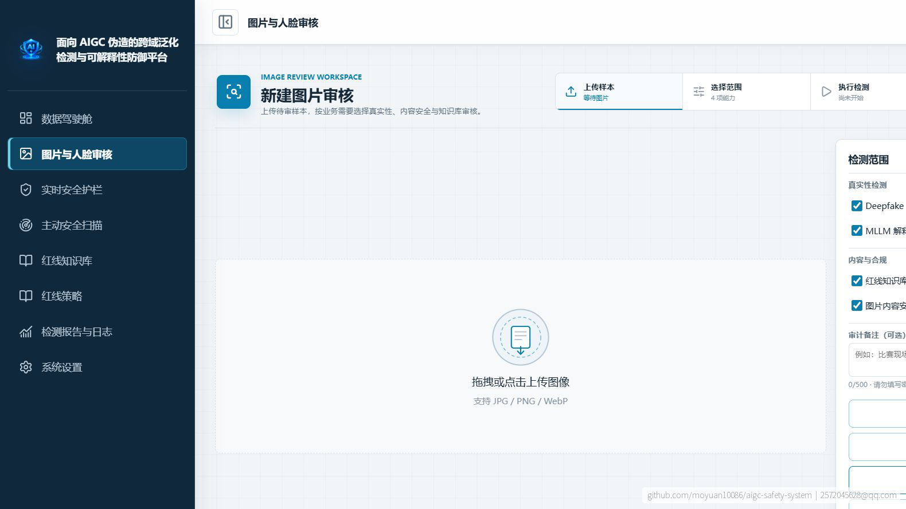
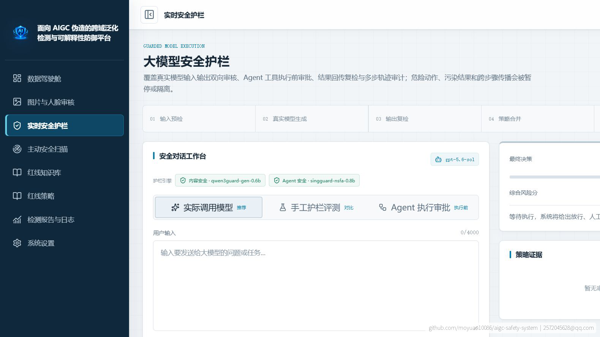
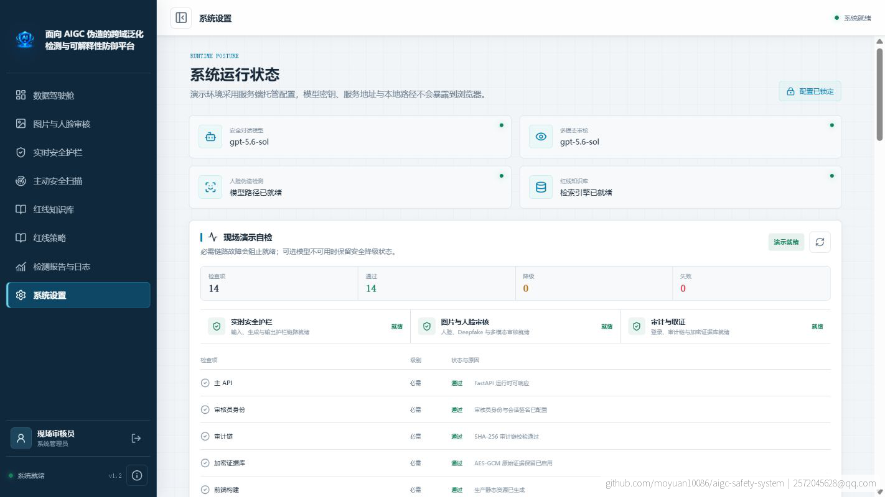

<div align="center">

# AIGC 安全审核系统

### 面向图片、文本与 Agent 的真实性检测、内容审核和安全审计平台

[](https://github.com/moyuan10086/aigc-safety-system)
[](#项目材料与成果)
[](#技术栈)
[](#技术栈)
[](LICENSE)

图片真实性分析 · AI 来源取证 · 内容安全审核 · RAG 红线知识库 · 大模型护栏 · Agent 门禁

</div>

中文 | [English](README_EN.md)

## 项目简介

平台面向 AIGC 伪造和生成式应用安全场景，统一处理图片真实性、内容风险、来源证据、模型输出和 Agent 工具调用，并将检测结论、证据和审计记录沉淀为可复核的报告。

## 系统界面

| 图片审核 | 实时安全护栏 | 系统就绪状态 |
| :---: | :---: | :---: |
|  |  |  |

<details>
<summary><strong>项目材料</strong></summary>

- [项目演示文稿（获奖分享版）](docs/competition-materials/项目演示文稿-获奖分享版.pdf)
- [项目作品报告（获奖分享版）](docs/competition-materials/项目作品报告-获奖分享版.pdf)
- [完整演示截图](docs/competition-materials/screenshots-20260814/)
- [演示视频（5 分 40 秒）](docs/competition-materials/演示视频-获奖分享版.mp4)

分享材料统一添加 GitHub 地址和项目联系方式水印。

</details>

## 目录

- [功能概览](#功能概览)
- [技术栈](#技术栈)
- [目录结构](#目录结构)
- [本地启动](#本地启动)
- [审核链路](#审核链路)
- [API](#对外-api-v1)
- [部署与测试](#服务器部署)
- [安全约定](#数据与安全约定)
- [项目材料与成果](#项目材料与成果)

## 功能概览

### 图片审核

- 人脸检测与局部 Deepfake 分析：逐脸推理，返回 `real`、`review`、`fake` 或 `inconclusive`。
- 多模态真实性分析：通过 OpenAI 兼容接口返回判断、证据、可疑区域、解释和耗时。
- 视觉内容安全：返回 `safe`、`review` 或 `unsafe`，包含风险类别、分数、证据和人工复核标记。
- AI 来源验证：读取 C2PA/Content Credentials、本地标记和其他可验证来源证据。
- OCR：识别图片/PDF 中的文字，支持人工修正后再次提交审核。
- 红线知识库：对 OCR 文本和手工文本执行关键词与语义检索。
- 审计水印：生成彩色审计副本、RGB 门限密钥分片和 ZIP 证据包，并支持导入核验。
- 检测报告：保存模块结果、OCR 文本、命中证据、来源证据、模型状态和运行耗时，可下载 JSON/Markdown。

### 文本与 Agent 护栏

- 文本输入、输出或双向审核，返回风险等级、命中规则、证据和处置建议。
- 受保护模型调用：输入预检、模型生成、输出复检，高风险输出隔离，边界结果转人工复核。
- Agent 工具执行前门禁、工具结果复检、多步轨迹审计和一次性审批凭证。
- 规则引擎始终可用；RAG、MLLM、Qwen3Guard、SingGuard 和 XGBoost Shadow 按配置作为增强组件。

## 技术栈

| 层级 | 技术 |
| --- | --- |
| 后端 | Python、FastAPI、Pydantic、Uvicorn |
| 前端 | Vue 3、TypeScript、Vite、Element Plus |
| 图片分析 | PyTorch、CLIP、YuNet、OpenCV、Pillow |
| 多模态调用 | OpenAI Python SDK、OpenAI 兼容网关 |
| OCR/RAG | PaddleOCR、ChromaDB、Sentence-Transformers |
| 流式接口 | HTTP `text/event-stream`、Fetch Streams |
| 审计存储 | SQLite、AES-GCM 加密证据库、SHA-256 哈希链 |

## 目录结构

```text
aigc-safety-system/
├── backend/
│   ├── routers/                  # API 路由
│   ├── services/                 # 检测、护栏、报告和审计服务
│   ├── config.py                 # 环境变量配置
│   ├── main.py                   # FastAPI 入口
│   └── pyproject.toml
├── frontend/
│   ├── src/views/                # 页面
│   ├── src/components/           # 可复用组件
│   └── package.json
├── deploy/                       # 部署和更新脚本
├── docs/                         # API、运维和设计文档
└── vendor/aigc-local-auditor/    # 固定版本的本地 Shadow 审核器
```

## 本地启动

### 环境要求

- Python 3.11+
- Node.js 20+
- `uv`（推荐）或等价 Python 虚拟环境
- 图片模型、YuNet 和 OCR 依赖按 `backend/pyproject.toml` 安装

### 配置

```bash
cp backend/.env.example backend/.env
```

常用配置如下。密钥只写入本地或服务器的 `.env`，不要提交到 Git：

```dotenv
MLLM_API_KEY=your-key
MLLM_BASE_URL=https://api.openai.com/v1
MLLM_MODEL=your-vision-model
MLLM_TIMEOUT_SECONDS=90

CHAT_MODEL_API_KEY=your-key
CHAT_MODEL_BASE_URL=https://api.openai.com/v1
CHAT_MODEL_NAME=your-text-model

GUARDRAIL_ENABLE_RAG=true
GUARDRAIL_ENABLE_MLLM=false
GUARDRAIL_ENABLE_QWEN_CLASSIFIER=false
GUARDRAIL_ENABLE_SINGGUARD_CLASSIFIER=false
GUARDRAIL_ENABLE_XGBOOST_SHADOW=false
```

### 启动命令

Windows 可直接运行：

```bat
start.bat
```

手动启动：

```bash
cd frontend
npm install
npm run build
cd ../backend
uv sync
uv run main.py
```

默认访问地址：<http://localhost:8010>

```bash
curl http://localhost:8010/api/health
```

## 审核链路

```text
图片/文本上传
    ├─ 人脸预检 ──> Deepfake 逐脸分析
    ├─ 来源验证 ──> C2PA / 本地标记 / 元数据证据
    ├─ MLLM ──────> 真实性解释
    ├─ 内容安全 ──> 视觉风险分类
    └─ OCR ───────> 人工修正 ──> RAG 红线检索
                         ↓
                 合并模块结果与审计证据
                         ↓
                    JSON / Markdown 报告
```

`POST /api/detect/full` 在人脸预检后并行执行独立模块。模块异常会返回 `status=degraded` 和 `error_code`，不会阻断其他模块或让整条流无响应。 `review`、`uncertain`、`inconclusive` 表示需要关注或人工复核，不代表安全通过。

## 内部检测 API

内部页面使用会话鉴权，图片接口均为 `multipart/form-data`。

| 方法 | 路径 | 作用 |
| --- | --- | --- |
| POST | `/api/detect/ocr` | 图片 OCR |
| POST | `/api/detect/deepfake` | 人脸局部伪造检测 |
| POST | `/api/detect/mllm` | 图片真实性分析 |
| POST | `/api/detect/content` | 文本内容安全审核 |
| POST | `/api/detect/image-content` | OCR + RAG + MLLM + 视觉内容安全 |
| POST | `/api/detect/provenance` | 图片来源证据验证 |
| POST | `/api/detect/full` | 全量 SSE 审计 |
| GET | `/api/detect/history` | 报告列表 |
| GET | `/api/detect/report/{report_id}` | 查看报告 |
| GET | `/api/detect/report/{report_id}/download` | 下载 JSON 报告 |
| GET | `/api/detect/report/{report_id}/download-md` | 下载 Markdown 报告 |

### 全量审计 SSE

```bash
curl -N -X POST http://localhost:8010/api/detect/full \
  -F 'image=@./sample.png' \
  -F 'modules=provenance,deepfake,mllm,content_safety,rag'
```

可能收到以下事件，完成顺序不固定：

```text
event: face
event: step       # parallel_analysis 或 report
event: provenance
event: deepfake
event: mllm
event: content_safety
event: ocr
event: rag
event: done       # 返回 report_id
```

前端使用 `fetch()` 读取响应流并解析 SSE；由于该接口是 POST，不使用原生 `EventSource`。

## 对外 API v1

线上演示地址不随仓库公开；项目截图、演示视频和水印材料请参见上方“项目展示”。

所有 v1 请求需要 API Key：

```http
Authorization: Bearer <api-key>
```

| 方法 | 路径 | Scope |
| --- | --- | --- |
| GET | `/api/v1/catalog` | `usage:read` |
| POST | `/api/v1/guardrail/check` | `guardrail:check` |
| POST | `/api/v1/guardrail/chat` | `guardrail:chat` |
| POST | `/api/v1/guardrail/agent/check` | `guardrail:agent` |
| POST | `/api/v1/guardrail/agent/result/check` | `guardrail:agent` |
| POST | `/api/v1/guardrail/agent/trajectory/check` | `guardrail:agent` |
| POST | `/api/v1/content/check` | `content:check` |
| POST | `/api/v1/images/face` | `image:face` |
| POST | `/api/v1/images/deepfake` | `image:deepfake` |
| POST | `/api/v1/images/mllm` | `image:mllm` |
| POST | `/api/v1/images/content-safety` | `image:content-safety` |
| POST | `/api/v1/images/provenance/verify` | `image:provenance` |
| POST | `/api/v1/images/audit-watermark/embed` | `image:audit-watermark` |
| POST | `/api/v1/images/audit-watermark/decode` | `image:audit-watermark` |
| POST | `/api/v1/images/audit-watermark/decode-archive` | `image:audit-watermark` |
| POST | `/api/v1/images/watermarks/check` | `image:watermark` |
| POST | `/api/v1/images/invisible-watermark/embed` | `image:watermark` |
| POST | `/api/v1/images/invisible-watermark/check` | `image:watermark` |
| GET | `/api/v1/usage` | `usage:read` |
| POST | `/api/v1/scans` | `scan:run` |
| GET | `/api/v1/scans` | `scan:read` |
| GET | `/api/v1/reports` | `report:read` |
| POST | `/api/v1/reports` | `report:write` |
| GET | `/api/v1/reports/{report_id}/download` | `report:read` |

JSON 请求示例：

```bash
curl -X POST "$BASE_URL/api/v1/guardrail/check" \
  -H "Authorization: Bearer <api-key>" \
  -H "Content-Type: application/json" \
  -d '{"prompt":"请介绍公开产品的安全能力","response":"","mode":"input","profile":"standard"}'
```

请求体必须是合法 JSON；不要在命令中使用 `<api-key>` 字面量，替换为真实 Key 或环境变量。

## 审计水印与证据包

审计水印不是 AI 来源证明，而是用于绑定检测结论、操作者和证据摘要的完整性机制。彩色审计副本、JSON sidecar、密钥分片和原图共同组成证据包。

```bash
curl -X POST "$BASE_URL/api/v1/images/audit-watermark/embed" \
  -H "Authorization: Bearer <api-key>" \
  -F 'image=@./original.png' \
  -F 'payload_json={"report_id":"rpt_demo","operator_id":"reviewer_01"}' \
  -o audit-package.zip

curl -X POST "$BASE_URL/api/v1/images/audit-watermark/decode-archive" \
  -H "Authorization: Bearer <api-key>" \
  -F 'archive=@audit-package.zip;type=application/zip'
```

RGB 水印采用门限密钥分片；缺少足够分片时返回 `422 threshold_not_met` 是预期保护行为。隐式标识图和审计副本是不同能力：前者用于隐藏载荷，后者用于可审计的彩色副本和证据包。

## 服务器部署

生产目录：`/root/CH/aigc-safety-system`

```bash
bash deploy/bootstrap.sh
bash deploy/update.sh
systemctl status aigc-safety.service
journalctl -u aigc-safety.service -f
```

服务默认监听 `0.0.0.0:8010`，由 systemd 管理。模型权重、`.env`、上传文件、报告、向量库和密钥不进入 Git；服务器更新前应确认运行时目录没有被脚本覆盖。

### 可选 GPU 专家

Qwen3Guard 和 SingGuard 使用 OpenAI 兼容的内部推理服务，只有启用开关、Base URL、模型名和 API Key 同时满足才会调用。服务不可用时规则/RAG 仍继续工作，并在 `engine`、`route_trace` 或 `components` 中记录状态。

## 测试与检查

```bash
cd backend
uv run pytest -q
cd ../frontend
npm run build
cd ..
git diff --check
```

建议至少验证：健康检查、空文本拒绝、OCR 无结果、无脸图片、MLLM 网关不可用、RAG 无命中、SSE 模块降级、报告下载、水印 ZIP 核验以及 API Key Scope 校验。

## 数据与安全约定

- API Key 只保存服务端摘要，明文只在签发响应中出现一次。
- 普通日志、报告摘要和 CSV 不保存提示词或危险模型输出原文；取证原文进入加密证据存储。
- 所有模块结果应区分 `completed`、`degraded`、`unavailable` 和 `inconclusive`。
- 不把“AI 生成”“存在水印”“C2PA 签发者”和“内容违规”互相等同；报告中分别展示这些维度。
- 生产环境不要开启开发热重载，不要把 `.env`、模型权重、证据库或真实测试图片提交到 Git。

## 项目材料与成果

本项目获得第十九届全国大学生信息安全竞赛（作品赛）暨第三届“长城杯”网数智安全大赛（作品赛）三等奖。

竞赛演示文稿、作品报告、完整截图和 5 分 40 秒演示视频位于 [`docs/competition-materials/`](docs/competition-materials/)。分享材料统一添加 GitHub 地址和项目联系方式水印；线上演示地址不随仓库公开。

- [项目演示文稿（获奖分享版）](docs/competition-materials/项目演示文稿-获奖分享版.pdf)
- [项目作品报告（获奖分享版）](docs/competition-materials/项目作品报告-获奖分享版.pdf)
- [完整演示截图](docs/competition-materials/screenshots-20260814/)
- [演示视频（5 分 40 秒）](docs/competition-materials/演示视频-获奖分享版.mp4)

## 相关文档

- `docs/open-api-manual.md`：对外 API 调用手册
- `docs/operator-manual.md`：运维与审核员操作手册
- `docs/provenance-api-quickstart.md`：来源验证快速开始
- `docs/goal-acceptance-audit-20260804.md`：验收记录

## 联系方式

项目交流：`2572045628@qq.com`

## 开源协议

本项目采用 [MIT License](LICENSE) 开源。
