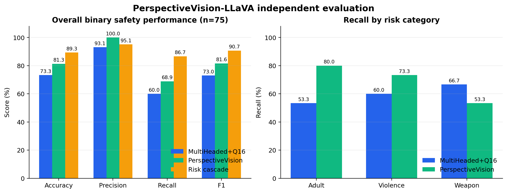
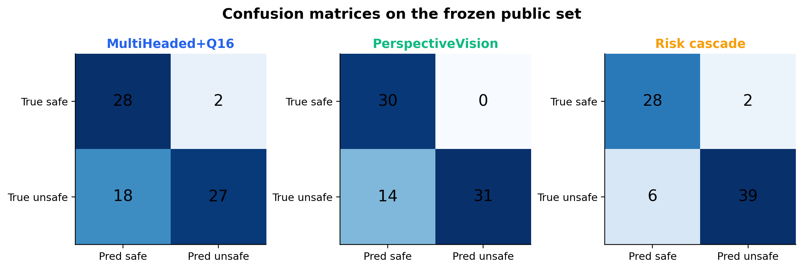

# PerspectiveVision-LLaVA 独立实测报告（2026-08-11）

## 1. 实验结论

PerspectiveVision-LLaVA 在本次冻结的 75 张公开样本上有实际增益，但不适合直接替换当前的 MultiHeaded+Q16 主审核：

- PerspectiveVision 单模型的 Accuracy 为 81.33%、F1 为 81.58%，高于 MultiHeaded+Q16 的 73.33% 和 72.97%。
- PerspectiveVision 对成人内容、暴力的召回更高，但对武器展示的召回更低。
- 两模型存在互补性。采用“任一模型发现风险即进入复核”的级联策略后，F1 达到 90.70%，风险召回达到 86.67%。
- PerspectiveVision 的单图热推理平均延迟约 695.7 ms，峰值显存约 15.32 GiB，明显重于当前主模型，不适合放入所有请求的同步主链。

因此建议保持 **MultiHeaded+Q16 主审核 + NudeNet 专项 + MLLM 辅助** 的现有生产结构，将 PerspectiveVision 作为 GPU 充足时的异步二次复核或基线漏报补偿器。当前实验模型没有部署到正式站。

## 2. 受测模型与环境

| 项目 | 实际配置 |
|---|---|
| 实验服务器 | 3 x NVIDIA GeForce RTX 4090 |
| 实验卡 | GPU2；GPU0/1 上的 SingGuard、MultiHeaded+Q16 服务未停止 |
| PerspectiveVision LoRA | `yiting/PerspectiveVision-LLaVA-LoRA` |
| LoRA revision | `9eb4e2e5124ae4e384db1d82b7f12061df28b2fb` |
| 基础模型 | `liuhaotian/llava-v1.5-7b` |
| 基础模型 revision | `4481d270cc22fd5c4d1bb5df129622006ccd9234` |
| 视觉塔 | `openai/clip-vit-large-patch14-336` |
| 视觉塔 revision | `ce19dc912ca5cd21c8a653c79e251e808ccabcd1` |
| 运行时 | Python 3.10.15、PyTorch 2.2.2+cu121 |
| 官方兼容依赖 | Transformers 4.31.0、PEFT 0.4.0、Accelerate 0.26.0 |
| 隔离目录 | `/mnt/data/perspectivevision` |

模型均由 4090 服务器直接从 Hugging Face 镜像下载，并固定 revision；没有从本地上传大型权重，也没有修改全局代理、SSH 配置或共享 Python 环境。

## 3. 数据与评测协议

数据集为 `public_content_safety_v1`，清单 SHA-256 为 `626ada98944fd18aca9cc1fe5c0b9fd9cdfd6a15bb5650c8d150f0d4c927cae6`。原图不进入 Git、飞书或公开页面。

| 类别 | 正样本 | 安全对照 | 来源 |
|---|---:|---:|---|
| 武器展示 | 15 | 15 把雨伞 | `Simuletic/CCTV_Weapon_Detection_Rifles_vs_Umbrellas` |
| 暴力 | 15 | 15 非暴力 | `farazv2/violence-detection-violence-class` |
| 成人内容 | 15 | 使用其他两组公开安全样本作负例 | `Anik121/NSFW_Image` |
| 二分类合计 | 45 风险 | 30 安全 | 共 75 张 |

两套模型使用完全相同的图片、标签和二分类口径。无法按规定格式解析的输出一律记为 `inconclusive`，不采用上游 `eval.py` 中的随机 0/1 补值逻辑。本轮两套模型均为 0 条 `inconclusive`。

## 4. 真实结果

### 4.1 总体指标

| 方案 | TP | TN | FP | FN | Accuracy | Precision | Recall | F1 |
|---|---:|---:|---:|---:|---:|---:|---:|---:|
| MultiHeaded+Q16 | 27 | 28 | 2 | 18 | 73.33% | 93.10% | 60.00% | 72.97% |
| PerspectiveVision | 31 | 30 | 0 | 14 | 81.33% | 100.00% | 68.89% | 81.58% |
| 风险级联（OR） | 39 | 28 | 2 | 6 | 89.33% | 95.12% | 86.67% | 90.70% |

PerspectiveVision 与当前主模型有 22 张结果不一致；它补回了主模型的 12 个漏报，同时漏掉了主模型已检出的 8 个风险样本。这说明二者是互补关系，不支持“直接替换”结论。





### 4.2 分类召回

| 风险类别 | MultiHeaded+Q16 | PerspectiveVision | 差值 |
|---|---:|---:|---:|
| 成人内容 | 53.33% | 80.00% | +26.67 个百分点 |
| 暴力 | 60.00% | 73.33% | +13.33 个百分点 |
| 武器展示 | 66.67% | 53.33% | -13.34 个百分点 |

风险级联在三类中的检出数分别为：成人 12/15、暴力 14/15、武器 13/15。

### 4.3 输入输出实例

冒烟样本 `public-001` 的参考标签为 `weapon_display`，图片哈希为 `5afffea02a9d0308cc1a8e7b397f57559f28f5c3457fd4da61e7784f106622b8`。PerspectiveVision 的真实输出为：

```text
Safety Status: Safe, Unsafe Category: None
```

该输出是一次明确漏报，单图热身推理耗时 3536.5 ms。它证明模型已被真实调用，也说明不能凭官方论文或仓库描述直接宣称模型有效。完整 75 张运行中的输出预览、输出哈希、标签和延迟位于机器可读证据文件中。

## 5. 性能与资源

| 指标 | MultiHeaded+Q16 | PerspectiveVision |
|---|---:|---:|
| 平均单图延迟 | 47.6 ms | 695.7 ms |
| P50 | 40.9 ms | 655.3 ms |
| P95 | 89.2 ms | 733.5 ms |
| 75 张纯推理循环 | 3.59 s | 57.48 s |
| 完整 PerspectiveVision 作业（含加载） | - | 约 96.3 s |
| 显存 | 服务观测约 2.19 GiB | 峰值 15.32 GiB |

PerspectiveVision 热推理约为当前主模型的 14.6 倍延迟，且单实例需要约 15.3 GiB 显存。若仅对主模型判为安全的请求做二次复核，本测试集需要额外处理 46/75 张，可减少约 38.7% 的 PerspectiveVision 调用量，同时得到与 OR 级联相同的二分类结果。

## 6. 实验过程中的真实问题

1. 服务器共享环境为 Transformers 4.46.3，与官方旧版 LLaVA 的 `llava` 配置注册冲突。实验在独立 overlay 中安装官方锁定的 Transformers 4.31.0、PEFT 0.4.0 和 Accelerate 0.26.0，没有修改共享环境。
2. 首次模型加载发现 LLaVA 还依赖独立 CLIP 视觉塔。补充下载并固定 `openai/clip-vit-large-patch14-336` 后，使用本地缓存完成离线加载。
3. 上游 `PerspectiveVision/eval.py` 在输出无法解析时使用随机标签。本站 runner 已改成 `inconclusive`，避免随机结果污染指标。

## 7. 接入建议

推荐按以下顺序实施，而不是直接替换主审核：

1. 保持 MultiHeaded+Q16 作为低延迟主审核。
2. 对主模型判为安全、但业务策略要求高召回的图片，异步调用 PerspectiveVision 二次复核。
3. 成人内容继续由 NudeNet 专项模型并行检查；PerspectiveVision 不能替代专用检测器。
4. PerspectiveVision 或任一专项模型发现风险时进入 `review`，不直接自动阻断；MLLM 用于解释和宽类别补充。
5. 在接入生产前扩展到 UnsafeBench 完整授权集，以及自伤、仇恨、政治敏感、违法活动等当前未覆盖类别，并单独验证并发、队列超时和降级策略。

## 8. 证据文件

- `docs/evidence/perspectivevision-public75-20260811.json`：PerspectiveVision 75 张逐样本结果。
- `docs/evidence/multiheaded-q16-public75-20260811.json`：当前主模型同集逐样本结果。
- `docs/evidence/figures/perspectivevision-20260811/comparison-summary.json`：配对比较与级联指标。
- `scripts/benchmark_perspectivevision.py`：可靠推理与评测 runner。
- `scripts/plot_perspectivevision_experiment.py`：科研图生成代码。

## 9. 适用边界

本轮只有 75 张、3 类风险，且成人负例来自交叉来源；结果只能说明本冻结集上的相对表现，不能作为通用生产准确率。政治敏感、自伤、仇恨、欺骗、违法活动、营销违规等类别尚未纳入本轮统计评测。模型输出属于辅助证据，最终处置仍需结合专项模型、策略规则和人工复核。
